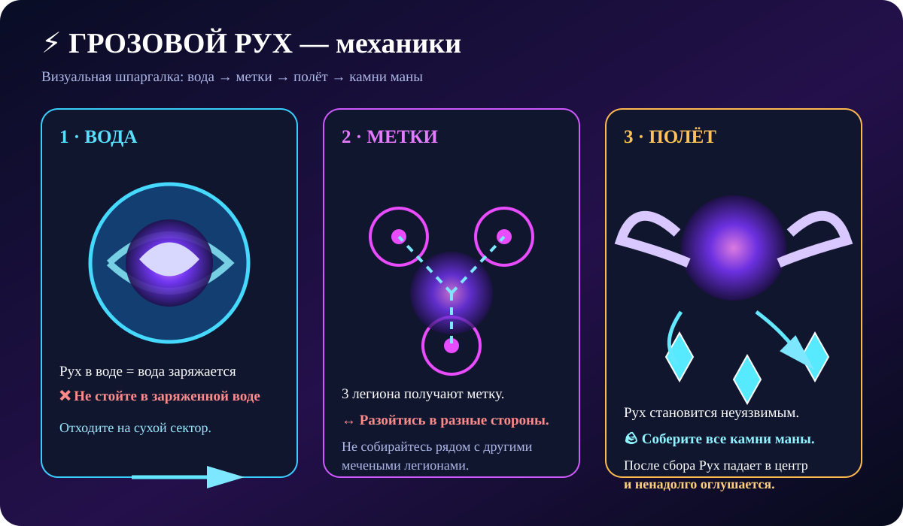

### 🎬 Визуальная схема боя

## ⚡ Главное {#mechanics}

У Руха нужно контролировать три вещи: **💧 вода → ⚡ метки → 🪨 камни маны**.

Танк держит Руха **в центре и на сухой земле**.

## 📚 Подготовка {#setup}

- 🛡️ 1–2 танка-пехотинца.
- 🏹 Лучники и маги — основной урон.
- 📍 Основная группа ближе к центру.
- 💧 Не стойте в воде во время электрических атак.
- ⏱️ Ярость — через 8 минут.

## 🧭 Позиционирование {#position}

Рух нужно держать в центре: после **Отбрасывания** легионы летят к краям арены, где находятся водоёмы.

> ❗ Не давайте Руху зайти в воду.

## 💧 Вода {#water}

### ⚡ Грозовой сбор

Рух наносит мощный электрический удар. Если он находится в воде, дополнительно поражается вода.

### 🔒 Грозовая клетка

Два водоёма становятся опасными и наносят постоянный урон около **4% максимального количества войск в секунду в течение 20 секунд**.

> 💧 Заряженный водоём — сразу покинуть.

## ⚡ Электрическая вспышка {#blast}

Рух выбирает **3 случайных легиона**. После задержки по ним ударяет молния и задевает ближайших.

### Что делать

1. ⚡ Получили метку.
2. 🏃 Сразу отходите от группы.
3. 💧 Не заходите в воду.
4. ⏱️ Дождитесь удара.
5. ↩️ Возвращайтесь после взрыва.

## 🕊️ Полёт {#soar}

Во время **Полёта** Рух недоступен для обычных атак. В водоёмах появляются **камни маны**.

**Собрать все камни → Рух падает → оглушение → максимальный урон.**

> 🪨 Камни нужно собирать сразу.

## 💀 Ярость

Через **8 минут** Рух становится в ярости и уничтожает легионы в логове.

## 🧩 Чек-лист {#tips}

✔️ Центр арены.  
✔️ Сухая земля.  
✔️ Метка = разойтись.  
✔️ Заряженная вода = уйти.  
✔️ Полёт = собрать камни.  
✔️ После падения — максимальный урон.  
✔️ Бой закончить до 8:00.

> ⚡ **Запомни:** центр → сухая земля → метка → камни → бурст.
