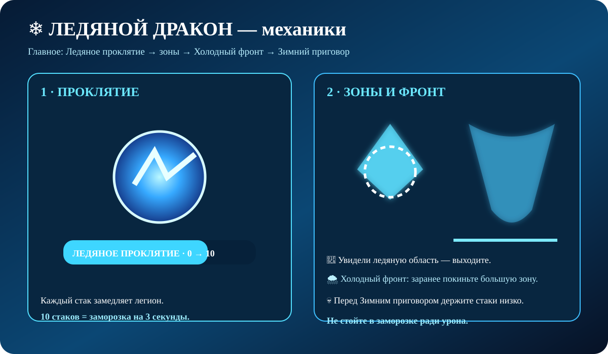

### 🎬 Визуальная схема боя

## ❄️ Главное {#mechanics}

Бой строится вокруг **Ледяного проклятия**. Стаки замедляют легион, а на 10 стаках он получает заморозку на 3 секунды.

> ❄️ **Главное:** постоянно контролируйте стаки и не допускайте заморозки перед опасной механикой.

## 📚 Подготовка {#setup}

- 🛡️ 2–3 танка с Насмешкой.
- 🏹 Основной урон — дальние отряды.
- 📍 Танку держать дракона лицом от рейда.
- 🧊 Следить за замороженными областями.
- 💚 После второй стадии забрать Камень лечения.

## 🧊 Ледяное проклятие {#curse}

Каждый стак снижает **скорость марша на 3%**.

На **10 стаках** легион получает **Заморозку на 3 секунды**, после чего стаки очищаются.

## 🧊 Ледяная тюрьма {#prison}

Ледяная тюрьма создаёт опасную область и накладывает Ледяное проклятие.

### Что делать

1. 👀 Увидели ледяную область.
2. 🏃 Выйдите из неё.
3. 📉 Следите за стаками.
4. ❄️ Не допускайте 10 стаков перед другой механикой.

## 🌨️ Холодный фронт {#front}

Дракон взлетает и пикирует, создавая большую ледяную область. Первая часть наносит около **10% максимального количества войск**, а после распространения заморозка наносит ещё около **35%**.

> 🏃 **Уходите из большой зоны заранее.** Не пытайтесь переждать атаку внутри.

## 💀 Зимний приговор {#reckoning}

Дракон наносит урон всем легионам в логове. Чем больше стаков Ледяного проклятия, тем больше получаемый урон. После удара стаки очищаются.

> ⚠️ Перед Зимним приговором особенно важно контролировать стаки.

## 🦎 Ледяные ящеры {#lizards}

**Холодный призыв** создаёт ледяного ящера, который периодически отмечает цель и применяет Ледяной ожог.

### 🌫️ Ползучий холод

Дракон поглощает замороженные области и стягивает их к себе, нанося постоянный урон и накладывая Ледяное проклятие.

## 💚 Камень лечения

После завершения второй стадии в логове появляется Камень лечения. Соберите его и восстановите легкораненых бойцов.

## 🧩 Чек-лист {#tips}

✔️ 2–3 танка.  
✔️ Держите дракона лицом от рейда.  
✔️ Следите за Ледяным проклятием.  
✔️ Не допускайте 10 стаков перед опасной атакой.  
✔️ На Холодном фронте заранее выходите из зоны.  
✔️ Следите за замороженными областями.  
✔️ После второй стадии забирайте Камень лечения.

> ❄️ **Запомни:** стаки → зоны → Холодный фронт → Зимний приговор → лечение.
