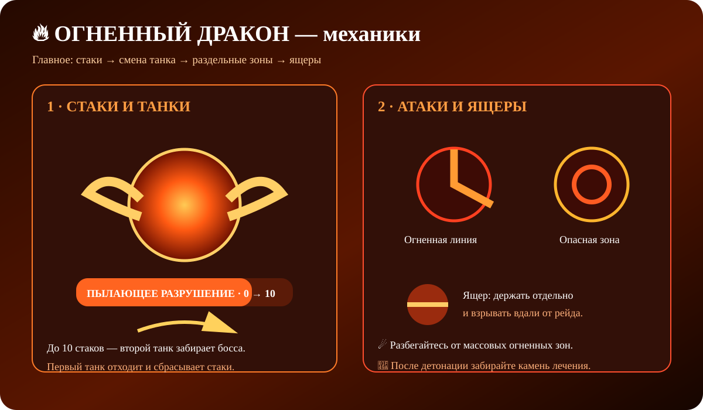

### 🎬 Визуальная схема боя

## 🔥 Главное {#mechanics}

Бой строится вокруг **Пылающего разрушения**. Передние атаки дракона накладывают стаки, а на 10 стаках следующий удар становится смертельным.

> 🔥 **Главное правило:** минимум два танка и постоянная смена босса между ними.

## 📚 Подготовка {#setup}

- 🛡️ 2+ танка-пехотинца с Насмешкой.
- 🏹 Основной урон — дальние отряды.
- 📏 Рейд держит дистанцию.
- ↔️ Танки заранее договариваются о смене.
- ⏱️ Ярость — через 10 минут.

## 🔥 Стаки и смена танков {#stacks}

**Удар драконьими когтями** и **Огненный рывок** дают по 1 стаку.

Каждый стак снижает защиту на **5% на 30 секунд**, максимум — **10 стаков**.

### 🔄 Правильная смена

1. Первый танк держит босса.
2. Второй забирает его Насмешкой.
3. Первый отходит и сбрасывает стаки.
4. После восстановления танки снова меняются.

> ⚠️ Не ждите 10 стаков — смена должна быть заранее.

## 🧭 Позиционирование {#position}

- 🔥 Спереди — Удар драконьими когтями и Огненный рывок.
- 🐉 Сзади — Удар хвостом.
- 💥 Вокруг — Прыжковый удар.

> ❌ Не стойте перед драконом и не прячьтесь постоянно за хвостом.

## ☄️ Огненные атаки {#fire}

### 🔥 Огненный шар
Случайная цель получает удар, а ближайшие легионы получают **50% максимального количества войск**.

### 💥 Пылающее возгорание
Мощная массовая атака на **100% максимального количества войск**. Держите легионы раздельно.

### 🌋 Теневой огненный рывок
Дракон проходит по линии, нанося **40% максимального количества войск** и оставляя горящую область.

### 🔥 Пылающее дыхание
Передняя дуга отбрасывает и оглушает, наносит **30% максимального количества войск** и оставляет горящую область.

### 😱 Рёв дракона
Накладывает страх и заставляет легионы двигаться неконтролируемо.

## 🦎 Бездонные ящеры {#lizards}

Во второй стадии появляются Бездонные ящеры. **Убить их обычным способом нельзя.**

Когда здоровье ящера опускается ниже порога, запускается **Принудительная детонация**. Через 10 секунд он взрывается, наносит **15% максимального количества войск** и создаёт Камень лечения.

- ↔️ Держите ящеров раздельно.
- 💣 Взрывайте их вдали от рейда.
- 💚 После взрыва забирайте Камень лечения.

> ❗ Ящер не должен взрываться внутри основной группы.

## 💀 Ярость {#rage}

Через **10 минут** дракон становится в ярости и мгновенно уничтожает все легионы в логове.

## 🧩 Чек-лист {#tips}

✔️ 2+ танка.  
✔️ Меняйте танков до 10 стаков.  
✔️ Не стойте перед драконом и за хвостом.  
✔️ Разбегайтесь на массовых атаках.  
✔️ Ящеров держите отдельно.  
✔️ Закончите бой до 10:00.

> 🔥 **Запомни:** стаки → смена танков → дистанция → ящеры → взрыв вдали.
